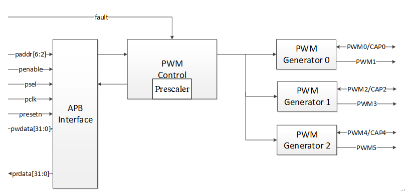

# BAUD_CALC

## 设备说明

Baudrate Calculation接口功能为通过PWM捕获特定UART数据来解析当前通讯的波特率，作为上电握手匹配通讯速率。

## 接口列表

Baud接口如下所示：

| 函数                   | 说明                 |
| ---------------------- | -------------------- |
| drv_calc_baud_original | 波特率原始值计算接口 |
| drv_calc_baud_adjust   | 波特率标准值计算接口 |

---

## 接口详细说明

### drv_calc_baud_original

```
int drv_calc_baud_original(uint32_t idx, uint32_t channel)
```

* 功能描述:

  * 通过该接口可返回当前串口通讯的真实波特率。

* 参数:
  
  * `idx`: pwm控制器设备号。
* `channel`: pwm输入捕获通道号。
  
* 返回值:

  * 错误码(-1)或者真实波特率

> 注意：
> 芯片用户手册中PIN复用功能总共有12路PWM通道可做选择，但是PWM控制器下挂了6组PWM发生器，每组发生器下外接了两路PWM，其中偶数通道可做输入捕获或者信号输出，奇数通道只能作为信号输出（如下图），当用户配置偶数通道作为输入捕获时，相同发生器下的另一路奇数通道则会被迫关闭输出功能，故针对该场景对于驱动代码做了**通用性设计**，接口中的通道选择实际根据发生器选择具体的控制通道。
> 比如当用户配置**通道1**作为输入或者输出时，实际对应的是下图中的“**PWM2**”，配置**通道2**时对应的是下图中的“**PWM4**“，以此类推，总共可控通道范围为**0~5**。



### drv_calc_baud_adjust

```
int drv_calc_baud_adjust(uint32_t idx, uint32_t channel)
```

* 功能描述:

  * 通过该接口可返回当前串口通讯的优化后的标准波特率。

  以下为目前支持的波特率检测标准频点（单位bps）：

  110，300，600，1200，2400，4800，9600，14400，19200，38400，56000，57600，115200，12800，230400，256000，460800，500000，512000，600000，750000，921600，1000000，1280000，1500000，2000000

* 参数:

  * `idx`: pwm控制器设备号。
  * `channel`: pwm输入捕获通道号。

* 返回值:

  * 错误码(-1)或者标准波特率

------

**注意**：

  1. 目前UART特定数据要求为16个字节的0x80；

  2. 目前测试用例采用两路UART进行各种波特率进行持续检测，一路UART作为回环捕获信号，另一路作为捕获数据LOG打印；

     具体步骤如下（danica举例说明）：

     1. 硬件回环搭建，其中TXD（PA1）和RXD（PA0）短接；

     2. 初始化UART0，并配置波特率为115300；

     3. 发送特定数据（16个0x80）；

     4. PA0切换引脚复用为PWM功能；

     5. 调用drv_calc_baud_original接口，则返回115317；
        或者调用drv_calc_baud_adjust接口，则返回115200；

     6. 重新初始化UART0，其中TXD（PA23）和RXD（PA24）；

     7. 配置固定波特率（9600）进行数据LOG打印；

## 真实波特率检测示例

```c
#include <stdio.h>
#include <soc.h>
#include <drv/pin.h>
#include "drv/baud_calc.h"

#define CHECK_RETURN(ret)                           \
        do {                                        \
            if (ret == 0) {                         \
                return -1;                          \
            }                                       \
        } while(0);


int main(void)
{
    int ret = 0;
    int baudrate;

    /* STEP 1: config RXD as pwm function */
    csi_pin_set_mux(TEST_BAUD_PWM_PORT, TEST_BAUD_PWM_FUNC);
    
    /* STEP 2: wait computer send data, baudrate is 115300*/
    ...
        
    /* STEP 3: calculation baudrate */
    baudrate = drv_calc_baud_original(TEST_BAUD_PWM_IDX, TEST_BAUD_PWM_CH);
    CHECK_RETURN(baudrate != -1);

    /* STEP 4: init uart and config baudrate */
    board_init();
	csi_uart_baud(&console_uart, baudrate);
    
    printf("Capture baudrate is %d\n", baudrate);
    
    /* STEP 5: compare baudrate with computer baudrate*/
    CHECK_RETURN((115000 < baudrate)&&(baudrate < 115500);

    return ret;
}
```

## 标准波特率检测示例

```
#include <stdio.h>
#include <soc.h>
#include <drv/pin.h>
#include "drv/baud_calc.h"

#define CHECK_RETURN(ret)                           \
        do {                                        \
            if (ret == 0) {                         \
                return -1;                          \
            }                                       \
        } while(0);


int main(void)
{
    int ret = 0;
    int baudrate;

    /* STEP 1: config RXD as pwm function */
    csi_pin_set_mux(TEST_BAUD_PWM_PORT, TEST_BAUD_PWM_FUNC);
    
    /* STEP 2: wait computer send data, baudrate is 115300*/
    ...
        
    /* STEP 3: calculation baudrate */
    baudrate = drv_calc_baud_adjust(TEST_BAUD_PWM_IDX, TEST_BAUD_PWM_CH);
    CHECK_RETURN(baudrate != -1);

    /* STEP 4: init uart and config baudrate */
    board_init();
	csi_uart_baud(&console_uart, baudrate);
    
    printf("Capture baudrate is %d\n", baudrate);
    
    /* STEP 5: compare baudrate with computer baudrate*/
    CHECK_RETURN(115200 == baudrate);

    return ret;
}
```

