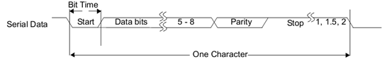
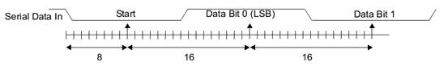
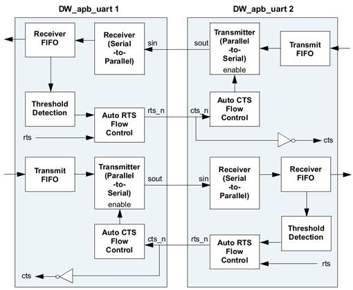
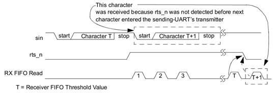
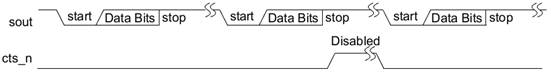

# Receiver/Transmitter (UART)

## Overview

The Universal Asynchronous Receiver/Transmitter (UART) is a key component of the serial communication subsystem of a MCU, modeled after the industry-standard 16550. However, the register address space has been relocated to 32-bit data boundaries for APB bus implementation. The UART is used for serial communication with a peripheral. Data is written from a master (CPU) over the APB bus to the UART and it is converted to serial form and transmitted to the destination device. Serial data is also received by the UART and stored for the master (CPU) to read back.

The UART contains registers to control the character length, baud rate, parity generation/checking, and interrupt generation. Although there is only one interrupt output signal (intr) from the UART, there are several prioritized interrupt types that can be responsible for its assertion. Each of the interrupt types can be separately enabled/disabled with the control registers. 

To reduce the time demand placed on the master by the UART, FIFOs are available to buffer transmit and receive data. This means that the master does not have to access the UART each time a single byte of data is received. The FIFOs are internal D-flip-flop based RAMs. 

The UART can interface with a DMA controller by way of external signals (dma_tx_req_n and dma_rx_req_n) to indicate when data is ready to be read or when the transmit FIFO is empty. 

System efficiency can be increased and software load decreased with a 16750-compatible Auto Flow Control Mode. When FIFOs and the Auto Flow Control are enabled, serial data flow is automatically controlled by the request-to-send (rts_n) output and clear-to-send (cts_n) input.

## Features

The UART component conforms to the AMBA Specification, Revision 2.0. The UART has the following features:

**UART Features**

- APB data bus widths of 32

- Transmit and receive FIFO depths of 16

- Internal FIFO (RAM)

- Additional DMA interface signals

- Auto Flow Control mode as specified in the 16750 standard

- Programmable character properties, such as number of data bits per character (5-8), optional parity bit (with odd or even select) and number of stop bits (1, 1.5 or 2)

- Line break generation and detection

- DMA signaling with two programmable modes

- Prioritized interrupt identification

##  Function Description

### UART (RS232) Serial Protocol

Because the serial communication between the UART and the selected device is asynchronous, additional bits (start and stop) are added to the serial data to indicate the beginning and end. Utilizing these bits allows two devices to be synchronized. This structure of serial data accompanied by start and stop bits is referred to as a character, as shown in Figure 12‑2.

​															Figure 12‑2 Serial Data Format

An additional parity bit may be added to the serial character. This bit appears after the last data bit and before the stop bit(s) in the character structure to provide the UART with the ability to perform simple error checking on the received data.

The UART Line Control Register is used to control the serial character characteristics. The individual bits of the data word are sent after the start bit, starting with the least-significant bit (LSB). These are followed by the optional parity bit, followed by the stop bit(s), which can be 1, 1.5 or 2. 

All the bits in the transmission (with exception to the half stop bit when 1.5 stop bits are used) are transmitted for exactly the same time duration. This is referred to as a Bit Period or Bit Time. One Bit Time equals 16 baud clocks. To ensure stability on the line the receiver samples the serial input data at approximately the midpoint of the Bit Time once the start bit has been detected. As the exact number of baud clocks that each bit was transmitted for is known, calculating the midpoint for sampling is not difficult, that is every 16 baud clocks after the midpoint sample of the start bit. Figure 12‑3 shows the sampling points of the first couple of bits in a serial character.

​														Figure 12‑3 Receiver Serial Data Sample Points

### Interrupt

The assertion of the UART interrupt output signal (intr) occurs whenever one of the several prioritized interrupt types are enabled and active. The following interrupt types can be enabled with the IER register:

● Receiver Error

● Receiver Data Available 

● Character Timeout

● Modem Status

When an interrupt occurs, the master accesses the IIR 

### Auto Flow Control

The UART has a 16750-compatible Auto RTS and Auto CTS serial data flow control mode available. Auto Flow Control mode can be enabled with the Modem Control Register (MCR[5]). Figure 12‑4 shows a block diagram of the Auto Flow Control functionality.

​												Figure 12‑4 Auto Flow Control Block Diagram

- Auto RTS and Auto CTS are described as follows:

- Auto RTS – Becomes active when the following occurs: 

- RTS (MCR[1] bit and MCR[5]bit are both set)

- FIFOs are enabled (FCR[0]) bit is set)

When Auto RTS is enabled (active), the rts_n output is forced inactive (high) when the receiver FIFO level reaches the threshold set by FCR[7:6]. When rts_n is connected to the cts_n input of another UART device, the other UART stops sending serial data until the receiver FIFO has available space (until it is completely empty). 

The selectable receiver FIFO threshold values are: 1, ¼, ½, and “2 less than full”. Since one additional character may be transmitted to the UART after rts_n has become inactive (due to data already having entered the transmitter bloc k in the other UART), setting the threshold to “2 less than full” allows maximum use of the FIFO with a safety zone of one character.

Once the receiver FIFO becomes completely empty by reading the Receiver Buffer Register (RBR), rts_n again becomes active (low), signaling the other UART to continue sending data. It is important to note that even if everything else is selected and the correct MCR bits are set, if the FIFOs are disabled through FCR[0], Auto Flow Control is also disabled. When Auto RTS is not implemented or disabled, rts_n is controlled solely by MCR[1]. Figure 12‑5 shows a timing diagram of Auto RTS operation.

​																	Figure 12‑5 Auto RTS Timing

- Auto CTS – becomes active when the following occurs:

- AFCE (MCR[5] bit is set)

- FIFOs are enabled through FIFO Control Register FCR[0] bit

When Auto CTS is enabled (active), the UART transmitter is disabled whenever the cts_n input becomes inactive (high). This prevents overflowing the FIFO of the receiving UART. 

If the cts_n input is not inactivated before the middle of the last stop bit, another character is transmitted before the transmitter is disabled. While the transmitter is disabled, the transmitter FIFO can still be written to, and even overflowed. 

Therefore, when using this mode, the following happens:

Ø   The UART status register can be read to check if the transmit FIFO is full (USR[1] set to zero).

Ø   The current FIFO level can be read via the TFL register.

When the cts_n input becomes active(low) again, transmission resumes. It is important to note that even if everything else is selected, if the FIFOs are disabled via FCR[0], Auto Flow Control is also disabled. When Auto CTS is disabled, the transmitter is unaffected by cts_n. A Timing Diagram showing Auto CTS operation can be seen in Figure 12‑6.

​																Figure 12‑6 Auto CTS Timing

### UART Register Memory Map

| Name  | Address Offset | Width | Access | Reset Value | Description                       |
| :---: | :------------: | :---: | :----: | :---------: | :-------------------------------- |
|  RBR  |      0x0       |  32   |   RO   |     0x0     | Receive Buffer Register           |
|  THR  |      0x0       |  32   |   WO   |     0x0     | Transmit Holding Register         |
|  DLL  |      0x0       |  32   |   RW   |     0x0     | Divisor Latch (Low)               |
|  DLH  |      0x4       |  32   |   RW   |     0x0     | Divisor Latch (High)              |
|  IER  |      0x4       |  32   |   RW   |     0x0     | Interrupt Enable Register         |
|  IIR  |      0x8       |  32   |   RO   |    0x41     | Interrupt Identification Register |
|  FCR  |      0x8       |  32   |   WO   |     0x0     | FIFO Control Register             |
|  LCR  |      0xc       |  32   |   RW   |     0x0     | Line Control Register             |
|  MCR  |      0x10      |  32   |   RW   |     0x0     | Modem Control Register            |
|  LSR  |      0x14      |  32   |   RO   |    0x60     | Line Status Register              |
|  MSR  |      0x18      |  32   |   RO   |     0x0     | Modem Status Register             |
|  SCR  |      0x1c      |  32   |   RW   |     0x0     | Scratchpad Register               |
|  USR  |      0x7c      |  32   |   RO   |     0x6     | UART Status Register              |
|  TFL  |      0x80      |  32   |   RO   |     0x0     | Transmit FIFO Level               |
|  RFL  |      0x84      |  32   |   RO   |     0x0     | Receive FIFO Level                |
|  HTX  |      0xa4      |  32   |   RW   |     0x0     | Halt TX                           |
| DMASA |      0xa8      |  32   |   WO   |     0x0     | DMA Software Acknowledge          |
| IP_ID |     0xffc      |  32   |   RW   |   0x10001   | Uart edition id                   |

### UART Register and Field Description

RBR [0x0]

| Bits |   Name   | Access | Reset Value | Description                                                  |
| :--: | :------: | :----: | :---------: | :----------------------------------------------------------- |
| 31:8 | Reserved |  RSV   |     0x0     | -                                                            |
| 7:0  |    RB    |   RO   |     0x0     | Data byte received on the serial input port (sin) in UART mode, or the serial infrared input (sir_in) in infrared mode. The data in this register is valid only if the Data Ready (DR) bit in the Line Status Register (LCR) is set. If in non-FIFO mode (FIFO_MODE == NONE) or FIFOs are disabled (FCR[0] set to zero), the data in the RBR must be read before the next data arrives, otherwise it is overwritten, resulting in an over-run error. If in FIFO mode (FIFO_MODE != NONE) and FIFOs are enabled (FCR[0] set to one), this register accesses the head of the receive FIFO. If the receive FIFO is full and this register is not read before the next data character arrives, then the data already in the FIFO is preserved, but any incoming data are lost and an over-run error occurs. |

THR [0x0]

| Bits |   Name   | Access | Reset Value | Description                                                  |
| :--: | :------: | :----: | :---------: | :----------------------------------------------------------- |
| 31:8 | Reserved |  RSV   |     0x0     | -                                                            |
| 7:0  |    TH    |   WO   |     0x0     | Data to be transmitted on the serial output port (sout) in UART mode or the serial infrared output (sir_out_n) in infrared mode. Data should only be written to the THR when the THR Empty (THRE) bit (LSR[5]) is set. If in non-FIFO mode or FIFOs are disabled (FCR[0] = 0) and THRE is set, writing a single character to the THR clears the THRE. Any additional writes to the THR before the THRE is set again causes the THR data to be overwritten. If in FIFO mode and FIFOs are enabled (FCR[0] = 1) and THRE is set, x number of characters of data may be written to the THR before the FIFO is full. The number x (default=16) is determined by the value of FIFO Depth that you set during configuration. Any attempt to write data when the FIFO is full results in the write data being lost. |

DLL [0x0]

| Bits |   Name   | Access | Reset Value | Description                                                  |
| :--: | :------: | :----: | :---------: | :----------------------------------------------------------- |
| 31:8 | Reserved |  RSV   |     0x0     | -                                                            |
| 7:0  |  DIVLL   |   RW   |     0x0     | Lower 8 bits of a 16-bit, read/write, Divisor Latch register that contains the baud rate divisor for the UART. This register may only be accessed when the DLAB bit (LCR[7]) is set and the UART is not busy (USR[0] is zero). The output baud rate is equal to the serial clock (pclk if one clock design, sclk if two clock design (CLOCK_MODE == Enabled)) frequency divided by sixteen times the value of the baud rate divisor, as follows: baud rate = (serial clock freq) / (16 * divisor). Note that with the Divisor Latch Registers (DLL and DLH) set to zero, the baud clock is disabled and no serial communications occur. Also, once the DLL is set, at least 8 clock cycles of the slowest DW_apb_uart clock should be allowed to pass before transmitting or receiving data. |

DLH [0x4]

| Bits |   Name   | Access | Reset Value | Description                                                  |
| :--: | :------: | :----: | :---------: | :----------------------------------------------------------- |
| 31:8 | Reserved |  RSV   |     0x0     | -                                                            |
| 7:0  |  DIVLH   |   RW   |     0x0     | Upper 8-bits of a 16-bit, read/write, Divisor Latch register that contains the baud rate divisor for the UART. This register may only be accessed when the DLAB bit (LCR[7]) is set and the UART is not busy (USR[0] is zero). The output baud rate is equal to the serial clock (pclk if one clock design, sclk if two clock design (CLOCK_MODE == Enabled)) frequency divided by sixteen times the value of the baud rate divisor, as follows: baud rate = (serial clock freq) / (16 * divisor). Note that with the Divisor Latch Registers (DLL and DLH) set to zero, the baud clock is disabled and no serial communications occur. Also, once the DLH is set, at least 8 clock cycles of the slowest DW_apb_uart clock should be allowed to pass before transmitting or receiving data. |

IER [0x4]

| Bits |   Name   | Access | Reset Value | Description                                                  |
| :--: | :------: | :----: | :---------: | :----------------------------------------------------------- |
| 31:4 | Reserved |  RSV   |     0x0     | -                                                            |
| 3:3  |  EDSSI   |   RW   |     0x0     | Enable Modem Status Interrupt. This is used to enable/disable the generation of Modem Status Interrupt. This is the fourth highest priority interrupt. 0 = disabled 1 = enabled |
| 2:2  |   ELSI   |   RW   |     0x0     | Enable Receiver Line Status Interrupt. This is used to enable/disable the generation of Receiver Line Status Interrupt. This is the highest priority interrupt. 0 = disabled 1 = enabled |
| 1:1  |  ETBEI   |   RW   |     0x0     | Enable Transmit Holding Register Empty Interrupt. This is used to enable/disable the generation of Transmitter Holding Register Empty Interrupt. This is the third highest priority interrupt. 0 = disabled 1 = enabled |
| 0:0  |  ERBFI   |   RW   |     0x0     | Enable Received Data Available Interrupt. This is used to enable/disable the generation of Received Data Available Interrupt and the Character Timeout Interrupt (if in FIFO mode and FIFOs enabled). These are the second highest priority interrupts. 0 = disabled 1 = enabled |

IIR [0x8]

| Bits |   Name   | Access | Reset Value | Description                                                  |
| :--: | :------: | :----: | :---------: | :----------------------------------------------------------- |
| 31:8 | Reserved |  RSV   |     0x0     | -                                                            |
| 7:6  |  FIFOSE  |   RO   |     0x1     | FIFOs Enabled. This is used to indicate whether the FIFOs are enabled or disabled. 00 = disabled 11 = enabled |
| 5:4  | Reserved |  RSV   |     0x0     | -                                                            |
| 3:0  |   IID    |   RO   |     0x1     | Interrupt ID. This indicates the highest priority pending interrupt which can be one of the following types: 0000 = modem status 0001 = no interrupt pending 0010 = THR empty 0100 = received data available 0110 = receiver line status 0111 = busy detect 1100 = character timeout The interrupt priorities are split into four levels. Bit 3 indicates an interrupt can only occur when the FIFOs are enabled and used to distinguish a Character Timeout condition interrupt. |

FCR [0x8]

| Bits |   Name   | Access | Reset Value | Description                                                  |
| :--: | :------: | :----: | :---------: | :----------------------------------------------------------- |
| 31:8 | Reserved |  RSV   |     0x0     | -                                                            |
| 7:6  |    RT    |   WO   |     0x0     | RCVR Trigger. This is used to select the trigger level in the receiver FIFO at which the Received Data Available Interrupt is generated. In auto flow control mode it is used to determine when the rts_n signal is de-asserted. It also determines when the dma_rx_req_n signal is asserted in certain modes of operation. For details on DMA support, refer to “DMA Support”. The following trigger levels are supported: 00 = 1 character in the FIFO 01 = FIFO ¼ full 10 = FIFO ½ full 11 = FIFO 2 less than full |
| 5:4  |   TET    |   WO   |     0x0     | TX Empty Trigger. Writes have no effect when THRE_MODE_USER == Disabled. This is used to select the empty threshold level at which the THRE Interrupts are generated when the mode is active. It also determines when the dma_tx_req_n signal is asserted when in certain modes of operation. For details on DMA support, refer to “DMA Support”. The following trigger levels are supported: 00 = FIFO empty 01 = 2 characters in the FIFO 10 = FIFO ¼ full 11 = FIFO ½ full Reset Value: 0x0 |
| 3:3  | Reserved |  RSV   |     0x0     | -                                                            |
| 2:2  |  XFIFOR  |   WO   |     0x0     | XMIT FIFO Reset. This resets the control portion of the transmit FIFO and treats the FIFO as empty. This also de-asserts the DMA TX request and single signals when additional DMA handshaking signals are selected (DMA_EXTRA == YES). Note that this bit is 'self-clearing'. It is not necessary to clear this bit. |
| 1:1  |  RFIFOR  |   WO   |     0x0     | RCVR FIFO Reset. This resets the control portion of the receive FIFO and treats the FIFO as empty. This also de-asserts the DMA RX request and single signals when additional DMA handshaking signals are selected (DMA_EXTRA == YES). Note that this bit is 'self-clearing'. It is not necessary to clear this bit. |
| 0:0  |  FIFOE   |   WO   |     0x0     | FIFO Enable. This enables/disables the transmit (XMIT) and receive (RCVR) FIFOs. Whenever the value of this bit is changed both the XMIT and RCVR controller portion of FIFOs is reset. |

LCR [0xc]

| Bits |   Name   | Access | Reset Value | Description                                                  |
| :--: | :------: | :----: | :---------: | :----------------------------------------------------------- |
| 31:8 | Reserved |  RSV   |     0x0     | -                                                            |
| 7:7  |   DLAB   |   RW   |     0x0     | Divisor Latch Access Bit.Writeable only when UART is not busy (USR[0] is zero), always readable. This bit is used to enable reading and writing of the Divisor Latch register (DLL and DLH) to set the baud rate of the UART. This bit must be cleared after initial baud rate setup in order to access other registers. |
| 6:6  |    BC    |   RW   |     0x0     | Break Control Bit.This is used to cause a break condition to be transmitted to the receiving device. If set to one the serial output is forced to the spacing (logic 0) state. When not in Loopback Mode, as determined by MCR[4], the sout line is forced low until the Break bit is cleared. If SIR_MODE == Enabled and active (MCR[6] set to one) the sir_out_n line is continuously pulsed. When in Loopback Mode, the break condition is internally looped back to the receiver and the sir_out_n line is forced low. |
| 5:5  | Reserved |  RSV   |     0x0     | -                                                            |
| 4:4  |   EPS    |   RW   |     0x0     | Even Parity Select. Writeable only when UART is not busy (USR[0] is zero), always readable. This is used to select between even and odd parity, when parity is enabled (PEN set to one). If set to one, an even number of logic 1s is transmitted or checked. If set to zero, an odd number of logic 1s is transmitted or checked. |
| 3:3  |   PEN    |   RW   |     0x0     | Parity Enable. Writeable only when UART is not busy (USR[0] is zero), always readable. This bit is used to enable and disable parity generation and detection in transmitted and received serial character respectively. 0 = parity disabled 1 = parity enabled |
| 2:2  |   STOP   |   RW   |     0x0     | Number of stop bits. Writeable only when UART is not busy (USR[0] is zero), always readable. This is used to select the number of stop bits per character that the peripheral transmits and receives. If set to zero, one stop bit is transmitted in the serial data. If set to one and the data bits are set to 5 (LCR[1:0] set to zero) one and a half stop bits is transmitted. Otherwise, two stop bits are transmitted. Note that regardless of the number of stop bits selected, the receiver checks only the first stop bit. 0 = 1 stop bit 1 = 1.5 stop bits when DLS (LCR[1:0]) is zero, else 2 stop bit |
| 1:0  |   DLS    |   RW   |     0x0     | Data Length Select. Writeable only when UART is not busy (USR[0] is zero), always readable. This is used to select the number of data bits per character that the peripheral transmits and receives. The number of bit that may be selected areas follows: 00 = 5 bits 01 = 6 bits 10 = 7 bits 11 = 8 bits |

MCR [0x10]

| Bits |   Name   | Access | Reset Value | Description                                                  |
| :--: | :------: | :----: | :---------: | :----------------------------------------------------------- |
| 31:6 | Reserved |  RSV   |     0x0     | -                                                            |
| 5:5  |   AFCE   |   RW   |     0x0     | Auto Flow Control Enable, writeable and readable. When FIFOs are enabled and the Auto Flow Control Enable (AFCE) bit is set, Auto Flow Control features are enabled as described in “Auto Flow Control”. 0 = Auto Flow Control Mode disabled 1 = Auto Flow Control Mode enabled |
| 4:4  |    LB    |   RW   |     0x0     | LoopBack Bit. This is used to put the UART into a diagnostic mode for test purposes. If operating in UART mode, data on the sout line is held high, while serial data output is looped back to the sin line, internally. In this mode all the interrupts are fully functional. Also, in loopback mode, the modem control inputs (dsr_n, cts_n, ri_n, dcd_n) are disconnected and the modem control outputs (dtr_n, rts_n, out1_n, out2_n) are looped back to the inputs, internally. |
| 3:2  | Reserved |  RSV   |     0x0     | -                                                            |
| 1:1  |   RTS    |   RW   |     0x0     | Request to Send. This is used to directly control the Request to Send (rts_n) output. The Request To Send (rts_n) output is used to inform the modem or data set that the UART is ready to exchange data. When Auto RTS Flow Control is not enabled (MCR[5] set to zero), the rts_n signal is set low by programming MCR[1] (RTS) to a high. In Auto Flow Control, AFCE active (MCR[5] set to one) and FIFOs enable (FCR[0] set to one), the rts_n output is controlled in the same way, but is also gated with the receiver FIFO threshold trigger (rts_n is inactive high when above the threshold). The rts_n signal is de-asserted when MCR[1] is set low. Note that in Loopback mode (MCR[4] set to one), the rts_n output is held inactive high while the value of this location is internally looped back to an input. |
| 0:0  | Reserved |  RSV   |     0x0     | -                                                            |

LSR [0x14]

| Bits |   Name   | Access | Reset Value | Description                                                  |
| :--: | :------: | :----: | :---------: | :----------------------------------------------------------- |
| 31:8 | Reserved |  RSV   |     0x0     | -                                                            |
| 7:7  |   RFE    |   RO   |     0x0     | Receiver FIFO Error bit. This bit is only relevant when FIFOs are enabled (FCR[0] set to one). This is used to indicate if there is at least one parity error, framing error, or break indication in the FIFO. 0 = no error in RX FIFO  1 = error in RX FIFO This bit is cleared when the LSR is read and the character with the error is at the top of the receiver FIFO and there are no subsequent errors in the FIFO. |
| 6:6  |   TEMT   |   RO   |     0x1     | Transmitter Empty bit. If FIFOs enabled (FCR[0] set to one), this bit is set whenever the Transmitter Shift Register and the FIFO are both empty. If in non-FIFO mode or FIFOs are disabled, this bit is set whenever the Transmitter Holding Register and the Transmitter Shift Register are both empty. |
| 5:5  |   THRE   |   RO   |     0x1     | Transmit Holding Register Empty bit. If THRE mode is disabled (IER[7] set to zero) and regardless of FIFO’s being implemented/enabled or not, this bit indicates that the THR or TX FIFO is empty.  This bit is set whenever data is transferred from the THR or TX FIFO to the transmitter shift register and no new data has been written to the THR or TX FIFO. This also causes a THRE Interrupt to occur, if the THRE Interrupt is enabled. |
| 4:4  |    BI    |   RO   |     0x0     | Break Interrupt bit. This is used to indicate the detection of a break sequence on the serial input data.  If in UART mode, it is set whenever the serial input, sin, is held in a logic ‘0’ state for longer than the sum of start time+ data bits+ parity+ stop bits. In the FIFO mode, the character associated with the break condition is carried through the FIFO and is revealed when the character is at the top of the FIFO. Reading the LSR clears the BI bit. In the non-FIFO mode, the BI indication occurs immediately and persists until the LSR is read. |
| 3:3  |    FE    |   RO   |     0x0     | Framing Error bit. This is used to indicate the occurrence of a framing error in the receiver. A framing error occurs when the receiver does not detect a valid STOP bit in the received data.  In the FIFO mode, since the framing error is associated with a character received, it is revealed when the character with the framing error is at the top of the FIFO. When a framing error occurs, the UART tries to resynchronize. It does this by assuming that the error was due to the start bit of the next character and then continues receiving the other bit i.e. data, and/or parity and stop. It should be noted that the Framing Error (FE) bit (LSR[3]) is set if a break interrupt has occurred, as indicated by Break Interrupt (BI) bit (LSR[4]). 0 = no framing error  1 = framing error Reading the LSR clears the FE bit. |
| 2:2  |    PE    |   RO   |     0x0     | Parity Error bit. This is used to indicate the occurrence of a parity error in the receiver if the Parity Enable (PEN) bit (LCR[3]) is set.  In the FIFO mode, since the parity error is associated with a character received, it is revealed when the character with the parity error arrives at the top of the FIFO. It should be noted that the Parity Error (PE) bit (LSR[2]) is set if a break interrupt has occurred, as indicated by Break Interrupt (BI) bit (LSR[4]). 0 = no parity error  1 = parity error Reading the LSR clears the PE bit. |
| 1:1  |    OE    |   RO   |     0x0     | Overrun error bit. This is used to indicate the occurrence of an overrun error. This occurs if a new data character was received before the previous data was read. In the FIFO mode, an overrun error occurs when the FIFO is full and a new character arrives at the receiver. The data in the FIFO is retained and the data in the receive shift register is lost. 0 = no overrun error  1 = overrun error Reading the LSR clears the OE bit. |
| 0:0  |    DR    |   RO   |     0x0     | Data Ready bit. This is used to indicate that the receiver contains at least one character in the RBR or the receiver FIFO.  0 = no data ready  1 = data ready This bit is cleared when the receiver FIFO is empty in FIFO mode. |

MSR [0x18]

| Bits |   Name   | Access | Reset Value | Description                                                  |
| :--: | :------: | :----: | :---------: | :----------------------------------------------------------- |
| 31:8 | Reserved |  RSV   |     0x0     | -                                                            |
| 7:7  |   DCD    |   RO   |     0x0     | Data Carrier Detect. This is used to indicate the current state of the modem control line dcd_n. This bit is the complement of dcd_n. When the Data Carrier Detect input (dcd_n) is asserted it is an indication that the carrier has been detected by the modem or data set. 0 = dcd_n input is de-asserted (logic 1) 1 = dcd_n input is asserted (logic 0) In Loopback Mode (MCR[4] set to one), DCD is the same as MCR[3] (Out2). |
| 6:6  |    RI    |   RO   |     0x0     | Ring Indicator. This is used to indicate the current state of the modem control line ri_n. This bit is the complement of ri_n. When the Ring Indicator input (ri_n) is asserted it is an indication that a telephone ringing signal has been received by the modem or data set. 0 = ri_n input is de-asserted (logic 1) 1 = ri_n input is asserted (logic 0) In Loopback Mode (MCR[4] set to one), RI is the same as MCR[2] (Out1). |
| 5:5  |   DSR    |   RO   |     0x0     | Data Set Ready. This is used to indicate the current state of the modem control line dsr_n. This bit is the complement of dsr_n. When the Data Set Ready input (dsr_n) is asserted it is an indication that the modem or data set is ready to establish communications with the DW_apb_uart. 0 = dsr_n input is de-asserted (logic 1) 1 = dsr_n input is asserted (logic 0) In Loopback Mode (MCR[4] set to one), DSR is the same as MCR[0] (DTR). |
| 4:4  |   CTS    |   RO   |     0x0     | Clear to Send. This is used to indicate the current state of the modem control line cts_n. This bit is the complement of cts_n. When the Clear to Send input (cts_n) is asserted it is an indication that the modem or data set is ready to exchange data with the DW_apb_uart. 0 = cts_n input is de-asserted (logic 1) 1 = cts_n input is asserted (logic 0) In Loopback Mode (MCR[4] = 1), CTS is the same as MCR[1] (RTS). |
| 3:3  |   DDCD   |   RO   |     0x0     | Delta Data Carrier Detect. This is used to indicate that the modem control line dcd_n has changed since the last time the MSR was read. 0 = no change on dcd_n since last read of MSR 1 = change on dcd_n since last read of MSR Reading the MSR clears the DDCD bit. In Loopback Mode (MCR[4] = 1), DDCD reflects changes on MCR[3] (Out2). Note, if the DDCD bit is not set and the dcd_n signal is asserted (low) and a reset occurs (software or otherwise), then the DDCD bit is set when the reset is removed if the dcd_n signal remains asserted. |
| 2:2  |   TERI   |   RO   |     0x0     | Trailing Edge of Ring Indicator. This is used to indicate that a change on the input ri_n (from an active-low to an inactive-high state) has occurred since the last time the MSR was read. 0 = no change on ri_n since last read of MSR 1 = change on ri_n since last read of MSR Reading the MSR clears the TERI bit. In Loopback Mode (MCR[4] = 1), TERI reflects when MCR[2] (Out1) has changed state from a high to a low. |
| 1:1  |   DDSR   |   RO   |     0x0     | Delta Data Set Ready. This is used to indicate that the modem control line dsr_n has changed since the last time the MSR was read. 0 = no change on dsr_n since last read of MSR 1 = change on dsr_n since last read of MSR Reading the MSR clears the DDSR bit. In Loopback Mode (MCR[4] = 1), DDSR reflects changes on MCR[0] (DTR). Note, if the DDSR bit is not set and the dsr_n signal is asserted (low) and a reset occurs (software or otherwise), then the DDSR bit is set when the reset is removed if the dsr_n signal remains asserted. |
| 0:0  |   DCTS   |   RO   |     0x0     | Delta Clear to Send. This is used to indicate that the modem control line cts_n has changed since the last time the MSR was read. 0 = no change on ctsdsr_n since last read of MSR 1 = change on ctsdsr_n since last read of MSR Reading the MSR clears the DCTS bit. In Loopback Mode (MCR[4] = 1), DCTS reflects changes on MCR[1] (RTS). Note, if the DCTS bit is not set and the cts_n signal is asserted (low) and a reset occurs (software or otherwise), then the DCTS bit is set when the reset is removed if the cts_n signal remains asserted. |

SCR [0x1c]

| Bits |   Name   | Access | Reset Value | Description                                                  |
| :--: | :------: | :----: | :---------: | :----------------------------------------------------------- |
| 31:8 | Reserved |  RSV   |     0x0     | -                                                            |
| 7:0  |   SCR    |   RW   |     0x0     | This register is for programmers to use as a temporary storage space. It has no defined purpose in the UART. |

USR [0x7c]

| Bits |   Name   | Access | Reset Value | Description                                                  |
| :--: | :------: | :----: | :---------: | :----------------------------------------------------------- |
| 31:5 | Reserved |  RSV   |     0x0     | -                                                            |
| 4:4  |   RFF    |   RO   |     0x0     | Receive FIFO Full. This is used to indicate that the receive FIFO is completely full. 0 = Receive FIFO not full 1 = Receive FIFO Full This bit is cleared when the RX FIFO is no longer full. |
| 3:3  |   RFNE   |   RO   |     0x0     | Receive FIFO Not Empty. This is used to indicate that the receive FIFO contains one or more entries. 0 = Receive FIFO is empty 1 = Receive FIFO is not empty This bit is cleared when the RX FIFO is empty. |
| 2:2  |   TFE    |   RO   |     0x1     | Transmit FIFO Empty. This is used to indicate that the transmit FIFO is completely empty.  0 = Transmit FIFO is not empty 1 = Transmit FIFO is empty This bit is cleared when the TX FIFO is no longer empty. |
| 1:1  |   TFNF   |   RO   |     0x1     | Transmit FIFO Not Full. This is used to indicate that the transmit FIFO in not full. 0 = Transmit FIFO is full 1 = Transmit FIFO is not full This bit is cleared when the TX FIFO is full. |
| 0:0  |   BUSY   |   RO   |     0x0     | UART Busy. This is indicates that a serial transfer is in progress, when cleared indicates that the UART is idle or inactive. 0 = UART is idle or inactive 1 = UART is busy (actively transferring data) NOTE: It is possible for the UART Busy bit to be cleared even though a new character may have been sent from another device. That is, if the UART has no data in THR and RBR and there is no transmission in progress and a start bit of a new character has just reached the UART. This is due to the fact that a valid start is not seen until the middle of the bit period and this duration is dependent on the baud divisor that has been programmed. |

TFL [0x80]

| Bits |   Name   | Access | Reset Value | Description                                                  |
| :--: | :------: | :----: | :---------: | :----------------------------------------------------------- |
| 31:5 | Reserved |  RSV   |     0x0     | -                                                            |
| 4:0  |  TFIFOL  |   RO   |     0x0     | Transmit FIFO Level. This is indicates the number of data entries in the transmit FIFO. |

RFL [0x84]

| Bits |   Name   | Access | Reset Value | Description                                                  |
| :--: | :------: | :----: | :---------: | :----------------------------------------------------------- |
| 31:5 | Reserved |  RSV   |     0x0     | -                                                            |
| 4:0  |  RFIFOL  |   RO   |     0x0     | Receive FIFO Level. This is indicates the number of data entries in the receive FIFO. |

HTX [0xa4]

| Bits |      Name      | Access | Reset Value | Description                                                  |
| :--: | :------------: | :----: | :---------: | :----------------------------------------------------------- |
| 31:8 |    Reserved    |  RSV   |     0x0     | -                                                            |
| 7:7  | Uart_etb_tx_en |   RW   |     0x0     | Uart_etb_tx_req trigger enable                               |
| 6:6  | Uart_etb_rx_en |   RW   |     0x0     | Uart_etb_rx_req trigger enable                               |
| 5:1  |    Reserved    |  RSV   |     0x0     | -                                                            |
| 0:0  |     HALTTX     |   RW   |     0x0     | This register is use to halt transmissions for testing, so that the transmit FIFO can be filled by the master when FIFOs are implemented and enabled. 0 = Halt TX disabled 1 = Halt TX enabled Note, if FIFOs are not enabled, the setting of the halt TX register has no effect on operation. |

DMASA [0xa8]

| Bits |   Name   | Access | Reset Value | Description                                                  |
| :--: | :------: | :----: | :---------: | :----------------------------------------------------------- |
| 31:1 | Reserved |  RSV   |     0x0     | -                                                            |
| 0:0  | DMASACK  |   WO   |     0x0     | This register is use to perform a DMA software acknowledge if a transfer needs to be terminated due to an error condition. For example, if the DMA disables the channel, then the DW_apb_uart should clear its request. This causes the TX request, TX single, RX request and RX single signals to de-assert. Note that this bit is 'self-clearing'. It is not necessary to clear this bit. |

IP_ID [0xffc]

| Bits | Name  | Access | Reset Value | Description |
| :--: | :---: | :----: | :---------: | :---------- |
| 31:0 | IP_ID |   RW   |   0x10001   | IP_ID       |

